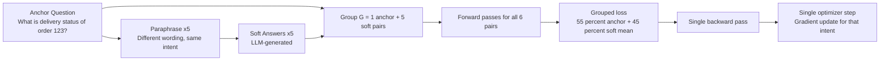
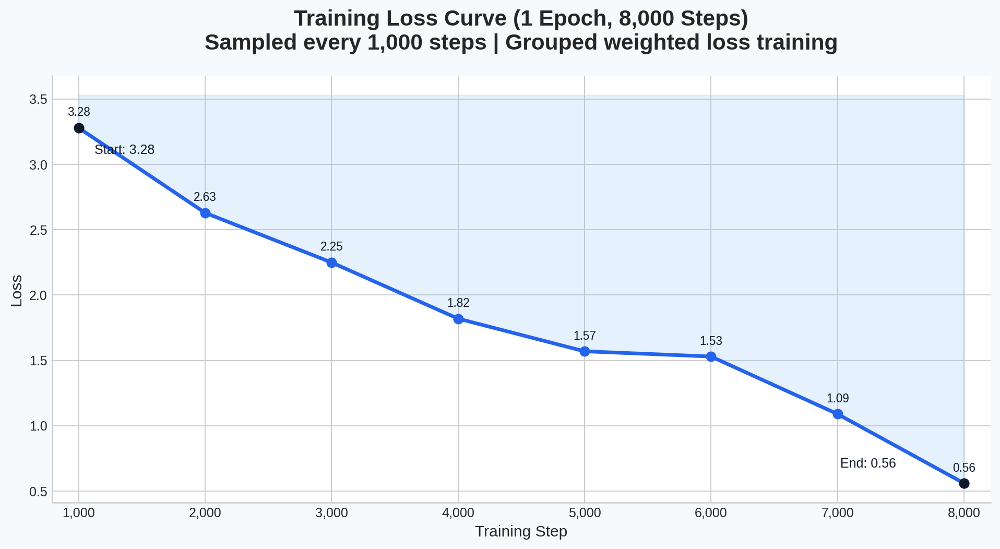
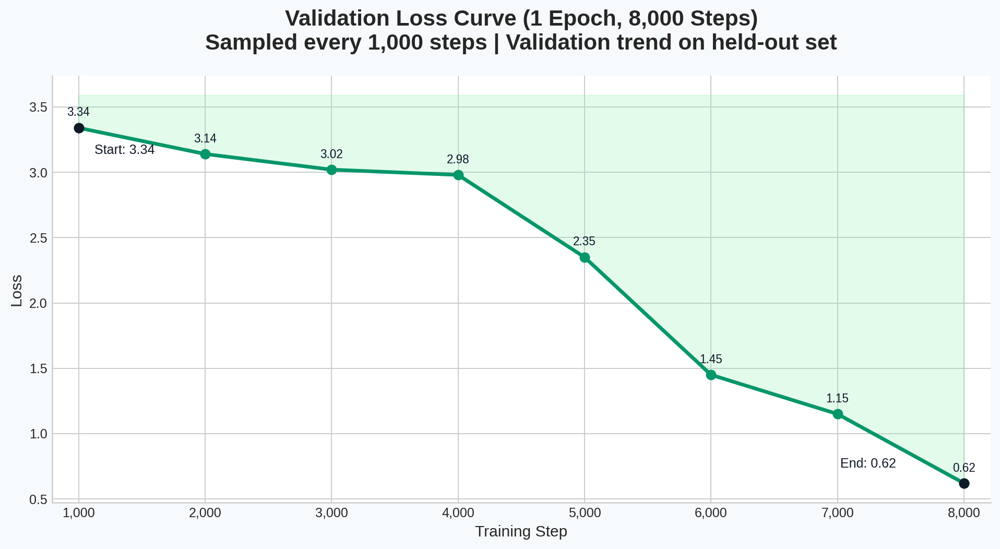

# MOL SLM: Grouped Augmentation Fine-Tuning for Shipping Q&A

[](https://www.python.org/downloads/)
[](https://developer.nvidia.com/cuda-toolkit)
[](https://pytorch.org/get-started/locally/)
[](https://huggingface.co/docs/transformers/index)
[](https://ollama.com/library/llama3.1)

> Train a shipping-domain assistant that learns **one intent expressed in multiple ways** by optimizing a **single grouped loss** per example.

## At a Glance

| Component | What it does |
|---|---|
| `step1_augment.py` | Expands each input question into 5 paraphrases + soft answers using Ollama |
| `step2_train.py` | Fine-tunes Gemma with grouped weighted loss: anchor + 5 soft pairs |
| `step3_infer.py` | Loads the fine-tuned model and runs interactive Q&A |

## Dataset Information

- Corpus source: ClassNK domain corpus
- Corpus size: approximately 6 million tokens
- QA synthesis model: Qwen3-14B
- Generated dataset size: 50K+ `question, answer` rows
- Generation runtime: approximately 5 days
- Generation hardware: NVIDIA V100 PCIe
- Expected local training file in this repo: `shipping_data.csv`

## Why This Training Signal Is Stronger

A single CSV row starts as one anchor pair: `(question, answer)`.

Step 1 creates 5 paraphrased questions that preserve intent, then generates soft answers for each. Now each training group contains:

- 1 anchor pair (ground truth)
- 5 soft pairs (semantic variants)

During Step 2, the model does **not** update after each pair independently. Instead, it processes all 6 pairs from the same intent group and performs one grouped update:

```text
L_group = 0.55 * L_anchor + 0.45 * mean(L_soft_1 ... L_soft_5)
```

This means the model sees multiple phrasings of the same user intent together before the optimizer step. That creates a richer gradient signal because:

1. Anchor pair keeps the update tied to real labeled behavior.
2. Paraphrases teach invariance to wording and sentence structure.
3. One grouped backward pass aligns the update across all variants of that intent.

## Training Flow (Intent Group View)



## System Architecture


## Training Information & Curves

Run configuration for this reported experiment:

- Epochs: `1`
- Total steps: `8,000`
- Logging interval for this visualization: every `1,000` steps
- Training loss range: `3.28 -> 0.56`
- Validation loss range (similar trend): `3.34 -> 0.62`

| Training Loss Curve | Validation Loss Curve |
|---|---|
|  |  |

Sampled points used for plotting:

| Step | Train Loss | Validation Loss |
|---|---:|---:|
| 1,000 | 3.28 | 3.34 |
| 2,000 | 2.63 | 3.14 |
| 3,000 | 2.25 | 3.02 |
| 4,000 | 1.82 | 2.98 |
| 5,000 | 1.57 | 2.35 |
| 6,000 | 1.53 | 1.45 |
| 7,000 | 1.09 | 1.15 |
| 8,000 | 0.56 | 0.62 |

## Repository Structure

```text
.
├── step1_augment.py
├── step2_train.py
├── step3_infer.py
├── requirements.txt
└── docs/
    ├── architecture.png
    ├── training_loss_curve.png
    └── validation_loss_curve.png
```

## Requirements

- Python `>= 3.10`
- `pip >= 23`
- Ollama server running at `http://localhost:11434`
- Ollama model: `llama3.1:8b`
- GPU strongly recommended for training (BF16-capable preferred)

## Install

```bash
pip install -r requirements.txt

# Install PyTorch matching your environment.
# Example (CUDA 12.8):
pip install torch torchvision torchaudio --index-url https://download.pytorch.org/whl/cu128
```

## Input Data Format

Create `shipping_data.csv` in the repo root:

```csv
question,answer
What is the delivery status of order #123?,The order is in transit.
```

## Run Pipeline

1. Start Ollama and pull model:

```bash
ollama serve
ollama pull llama3.1:8b
```

2. Generate grouped augmented data:

```bash
python step1_augment.py
```

3. Fine-tune with grouped weighted loss:

```bash
python step2_train.py
```

4. Run inference:

```bash
python step3_infer.py
```

## Outputs

- `augmented_groups.jsonl` - grouped dataset (`1 anchor + 5 soft` per row)
- `./gemma_finetuned/` - final model + tokenizer
- `./gemma_finetuned/checkpoint-step*/` - intermediate checkpoints

## Implementation Notes

- Resume support exists in Step 1 (already processed `group_id` values are skipped).
- Step 2 uses one optimizer step per group, not per pair.
- Default base model is `google/gemma-3-1b-it` (editable in script config).
