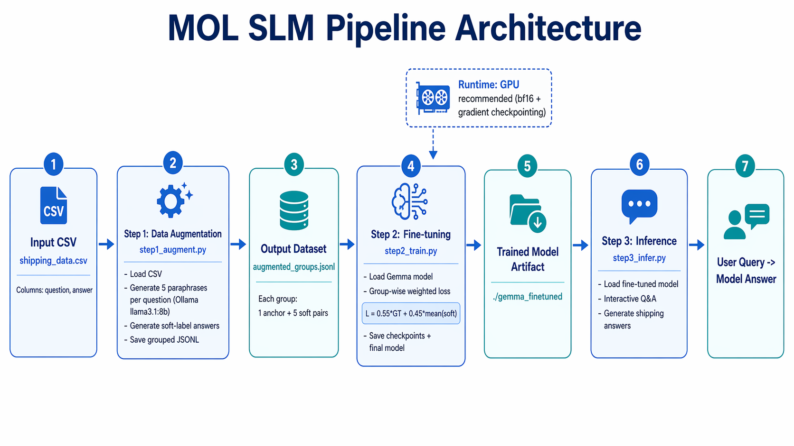

# MOL SLM: Shipping Domain Fine-Tuning Pipeline

```text
Requirements
- Python 3.10+
- Ollama running locally (http://localhost:11434)
- Ollama model pulled: llama3.1:8b
- Input CSV file: shipping_data.csv with columns [question, answer]
- GPU strongly recommended for training (bf16 + gradient checkpointing)
```

```bash
Dependencies
# Base project deps
pip install -r requirements.txt

# PyTorch (install variant matching your CUDA/CPU environment)
# Example for CUDA 12.8:
pip install torch torchvision torchaudio --index-url https://download.pytorch.org/whl/cu128
```

This repository implements a 3-step workflow to build a shipping/logistics assistant model:
1. Augment Q&A data with paraphrases and soft labels.
2. Fine-tune a Gemma instruction model using group-weighted loss.
3. Run interactive inference on the fine-tuned checkpoint.

## Project Purpose

The goal is to improve robustness to user phrasing variation by training with grouped examples:
- 1 ground-truth pair (`question`, `answer`) from your CSV.
- 5 synthetic paraphrase/answer pairs generated via Ollama.

During training, each group contributes a weighted objective:
- Ground-truth loss: `0.55`
- Soft-label mean loss: `0.45`

## Repository Structure

```text
.
├── step1_augment.py   # Generate grouped augmentation JSONL via Ollama
├── step2_train.py     # Fine-tune Gemma with grouped weighted loss
├── step3_infer.py     # Interactive inference loop
├── requirements.txt
└── docs/
    └── architecture.png
```

## Architecture



## Code Flow

### Step 1: Augmentation (`step1_augment.py`)
- Reads `shipping_data.csv` with columns `question`, `answer`.
- For each row:
  - Generates 5 paraphrased questions.
  - Generates soft-label answers for each paraphrase.
- Writes grouped records to `augmented_groups.jsonl`:
  - `anchor`: original QA (ground truth)
  - `soft`: 5 synthetic QA pairs

### Step 2: Training (`step2_train.py`)
- Loads `augmented_groups.jsonl`.
- Loads base model/tokenizer (`google/gemma-3-1b-it` by default).
- For each group:
  - Computes one loss per pair (anchor + 5 soft).
  - Combines with weighted objective:
    - `L = 0.55 * L_ground_truth + 0.45 * mean(L_soft_1..5)`
  - Performs one backward pass and optimizer step per group.
- Saves checkpoints periodically and final model to `./gemma_finetuned`.

### Step 3: Inference (`step3_infer.py`)
- Loads tokenizer/model from `./gemma_finetuned`.
- Accepts interactive questions from terminal.
- Generates answer text with controlled sampling (`temperature=0.3`).

## Setup

1. Install dependencies.
2. Start Ollama:
   ```bash
   ollama serve
   ```
3. Pull augmentation model:
   ```bash
   ollama pull llama3.1:8b
   ```
4. Prepare `shipping_data.csv` in repo root:
   ```csv
   question,answer
   What is the delivery status of order #123?,The order is in transit.
   ```

## Run Pipeline

1. Data augmentation:
   ```bash
   python step1_augment.py
   ```
2. Fine-tuning:
   ```bash
   python step2_train.py
   ```
3. Inference:
   ```bash
   python step3_infer.py
   ```

## Outputs

- `augmented_groups.jsonl`: grouped augmentation dataset.
- `./gemma_finetuned/`: final fine-tuned model + tokenizer.
- `./gemma_finetuned/checkpoint-step*/`: intermediate checkpoints.

## Notes

- Update config constants at the top of each script (paths, model IDs, training params) before large runs.
- `step1_augment.py` supports resume behavior by skipping already-written group IDs.
- Training and inference are functional on CPU, but GPU is recommended for practical runtimes.
